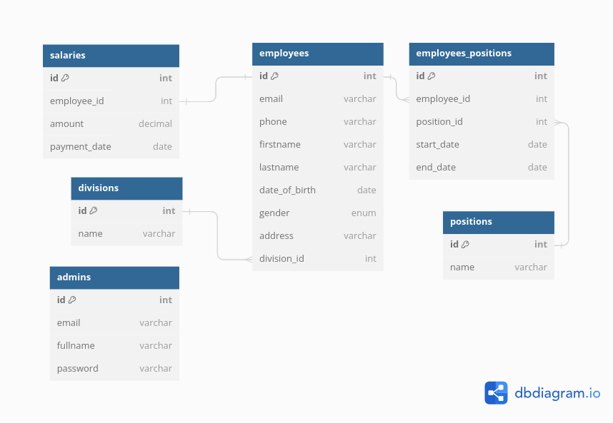

# Employee Management System

This is simple CRUD app for managing employees data, build with Laravel

## Database Schema

## Getting Started

- Clone
- install dependencies `composer install`
- set .env file (database,etc)
- generate app key `php artisan key:generate`
- run migration `php artisan migrate`
- run seeder
  - `php artisan db:seed AdminSeeder`  
  - `php artisan db:seed DivisionSeeder`
  - `php artisan db:seed PositionSeeder`
  - `php artisan db:seed EmployeeSeeder`
- run server `php artisan serve`

## Author

Ahmad Ma'ruf [LinkedIn](https://www.linkedin.com/in/ahmaruff/)

----

Ahmad Ma'ruf &copy; 2024

